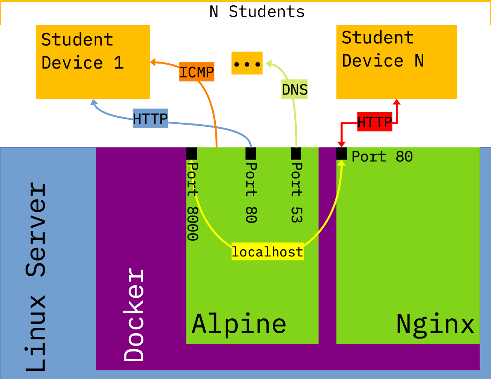

# CTF - Open the Floodgate

## For the Instructor(s)

### SEED Labs

This CTF challenge is based on the SEED Labs
[Packet Sniffing and Spoofing Lab](https://seedsecuritylabs.org/Labs_20.04/Networking/Sniffing_Spoofing/).
Students will be instructed to visit a web page, and will be presented with a simple, static web page.
Once a student visits the target web page, the web server will begin to send network packets to the student's machine.
It is up to the student to identify the incoming network traffic, and follow the traffic flow to find the flag.

### Docker

The Docker application used for this challenge consists of two containers.
One of the containers is running [nginx](https://hub.docker.com/_/nginx/), functioning as a reverse proxy.
The other container is based on [Alpine Linux with Python 3](https://hub.docker.com/_/python), and is running both
[gunicorn](https://gunicorn.org/) and [flask](https://flask.palletsprojects.com/en/2.2.x/),
in which gunicorn feeds HTTP requests form the nginx reverse proxy to the flask web app.

The two containers are using [host networking mode](https://docs.docker.com/network/host/), which means that they will not use
Docker's isolated networking stack, but instead will use the host machine's network stack.
The reason for using host networking mode is so that the nginx reverse proxy container is able to see the real external IP address of clients
that send it HTTP requests, which it was unable to do when using the default isolated Docker network.
The nginx reverse proxy container exposes **port 80** on the host to receive HTTP requests, and the container running the flask web app exposes
**port 8000** on the host to receive proxied HTTP requests from the nginx container.
**If you have any other programs on your host machine that use port 80 or port 8000 they will need to be stopped in order to run this CTF
challenge.**

#### Modifying the Flag

The flag is set as an environment variable in the container running the flask web app.
To modify the flag:

1. Open the file [`docker-compose.yml`](./docker-compose.yml) in a text editor.
2. Find the line beginning with `CTF_FLAG`, which is nested under:
```
services
└─ flask_web_app
      └─ environment
         └─ CTF_FLAG
```
3. Modify the contents between the parenthesis:\
`CTF_FLAG: "CHANGE ME"` -> `CTF_FLAG: "New_Flag"`

**NOTE:** The flag technically is able to contain white space characters, but it is advised to omit white space characters
so that there is no confusion when students find the flag.

#### Managing the Docker App

There is a supplied Bash script, [`dockerHelper.sh`](./dockerHelper.sh), that will assist with managing the Docker container for this CTF.
Running `dockerHelper.sh` without any parameters or passing it the `-h` parameter will print a help dialogue for the script.
You may need to run `dockerHelper.sh` with root privileges if any of the Docker commands executed by the script fail.
The following is a summary of the available functions supplied by the script:

| Function                    | Command                         |
| --------------------------- | ------------------------------- |
| Start the Docker App        | `$ [sudo] ./dockerHelper.sh -r` |
| Stop the Docker App         | `$ [sudo] ./dockerHelper.sh -k` |
| Check the Docker App Status | `$ [sudo] ./dockerHelper.sh -s` |

Commands can be concatenated in one call to the script, and the function will be executed in the order in which the argument flag appears:

| Functions                                               | Command                       |
| ------------------------------------------------------- | ----------------------------- |
| Start the Docker app, then print the status of the app. | `$ [sudo] ./dockerHelper -rs` |
| Stop the Docker app, then start it again.               | `$ [sudo] ./dockerHelper -kr` |

#### Docker Architecture

The following image shows the Docker architecture of the CTF challenge:



### Deploying the Challenge

Instruct the students to use a web browser to view the HTTP page served from port 80 on the host machine running the Docker app:
<http://DOCKER_APP_HOST_IP:80>

### Troubleshooting

If it seems that the students are not receiving the network packets from the web server, you may need to instruct them to disable any firewalls
or open the following ports on their machines:
* Port 53
* Port 80

## For the Student(s)

Using a web browser, navigate to the following HTTP website, specifying port 80 as the destination port: <http://DOCKER_APP_HOST_IP:80>
