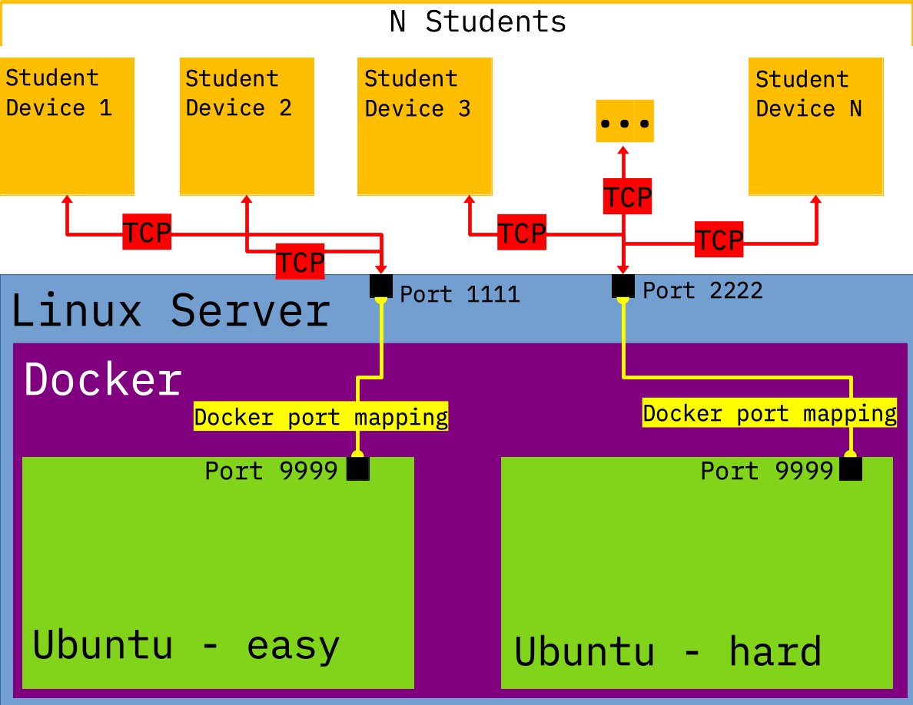

# CTF - Format String

## For the Instructor(s)

### SEED Labs

This CTF is based on the [Format-String Vulnerability Lab](https://seedsecuritylabs.org/Labs_20.04/Software/Format_String/).

### Easy and Hard Challenges

The Docker Image used for this challenge is running [xinetd](https://en.wikipedia.org/wiki/Xinetd), which will listen for incoming connection requests from students and issue a response based on the students input.
On the Docker Image there is the binary executable of a program that is vulnerable to a format string attack.

This CTF has been broken into two nearly identical versions, with one being denoted as the easy version, and the other denoted as the hard version.
The difference between the easy and hard version of the challenge is in the vulnerable program running on the Docker app.
In the easy version of the challenge, the vulnerable program prints out helpful information that can be used to exploit the format string vulnerability, and the flag can be retrieved from the vulnerable program's memory.
In the hard version of the challenge this helpful information is not printed for the student, and the flag is contained in a file that is on the filesystem of the Docker container.

Both the easy and hard versions of the challenge can be deployed simultaneously from the same host machine and they should not interfere with each other.
There is one `docker-compose.yml` file that specifies the necessary parameters for both versions of the challenge.

#### Configuring the Docker Image

##### Modifying the Flag

In the easy version of the challenge, the flag is embedded in the program memory of the vulnerable program.
There is an argument that gets passed to the easy version of the Docker Image at build time, called `FLAG_IN_MEM`.
Modify the argument `FLAG_IN_MEM` to update the flag.
Please note that **space characters are not permitted in the flag!**
The flag gets passed into the Docker image at build time, and is translated into a C preprocessor macro in the vulnerable program.
If there are any space characters in the flag it will not be correctly interpreted as a C preprocessor macro.

In the hard version of the challenge, there is a file called `flag.txt` that will be copied in plaintext into the Docker Image, and will reside on the containers file system.
Simply modify the contents of `ctf/category-software/Format_String/src/server/flag.txt` to update the flag.
There are no restrictions on what `flag.txt` may contain.

#### Building the Docker Image

There is a build script supplied that will build both the easy and hard versions of the challenge: `build.sh`.

You should build the Docker image before running for the first time, or after you make any changes to the Docker source image files.
To build:
```
$ cd ctf/category-software/Format_String
$ ./build.sh
```

#### Starting the Docker App

There is a start script supplied that will start the Docker containers: `start.sh`.
The start script can start the easy version container or the hard version container individually, or by default will start both containers.

**WARNING:** In order to run this CTF, Address Space Layout Randomization ([ASLR](https://en.wikipedia.org/wiki/Address_space_layout_randomization)) will be disabled on the host machine that's hosting the challenge.
ASLR must be disabled on the host so that it'll be disabled in the Docker app.
Disabling ASLR makes it much more likely that this CTF can be solved, since ASLR is a countermeasure that is quite effective at mitigating buffer overflow attacks.
The `start.sh` script will disable ASLR on the host machine, and will print a large and obvious warning message about this.
**If ASLR is enabled** when the Docker application starts, then the Docker application will not start properly.
When the Ubuntu containers start, a that status of ASLR is queried.
If ASLR is enabled, then the container will die (the SSH server that is the main process keeping the container alive will not be started), and querying the status (via `$ docker ps`) of the Docker application will show that the container is stuck in an infinite loop of restarting.
This infinite loop of restarting is because there is no process running that will keep the Docker container alive, so the container exits, but Docker is configured to restart any container that exits.
If you see that the Ubuntu containers are stuck in a loop of restarting, then you should disable ASLR on your host machine so that they'll be disabled in the Ubuntu containers.

You should build the Docker image before running the start script.
To start the Docker app:
```
$ cd ctf/category-software/Format_String
$ ./start.sh -h # Print help instructions
$ ./start.sh
```

#### Checking the health of the Docker app

Issuing the command `$ sudo docker ps` will list all of the Docker containers running on the host system.
If the status of the two challenge containers are unhealthy, this either means that ASLR is enabled on the container or that the vulnerable program is not being served by xinetd.
If the containers are unhealthy, the easiest way to troubleshoot them will be to restart the containers.

#### Stopping the Docker App

There is a stop script supplied that will stop the Docker containers: `stop.sh`.
The stop script can stop the easy version container or the hard version container individually, or by default will stop both containers.
The stop script will prompt you if you want to enable ASLR on the host machine.

**WARNING:** In the event that ASLR is enabled while a container is still running, then ASLR will immediately be enabled in the Docker container.
This may have the side effect of making the CTF challenge more difficult to solve if ASLR is enabled mid run.
It is recommended to enable ASLR if you intend to stop both the easy and hard versions of the challenge.

To execute the stop script:
```
$ cd ctf/category-software/Format_String
$ ./stop.sh -h # Print help instructions
$ ./stop.sh
```

#### Deploying the Challenge

As specified in the `docker-compose.yml` file, the easy version of the challenge maps to port 1111 on the host machine, and the hard version of the challenge maps to port 2222 on the host machine.
A TCP connection should be established on either of these two ports to interact with the corresponding challenge.
It is recommended for the students to use [netcat](https://en.wikipedia.org/wiki/Netcat) to establish a TCP connection with the challenge servers.

#### Docker Architecture

The following image shows the Docker architecture of the CTF challenge:



## For the Student(s)

There are two versions of this challenge, an easy and a hard version.
You will establish a TCP connection with the servers hosting the challenges.
It is recommended to use [netcat](https://en.wikipedia.org/wiki/Netcat) to establish a TCP connection with the challenge servers.
The easy version of the challenge is bound to the hosting machine on port 1111, and the hard version of the challenge is bound to the hosting machine on port 2222.

To use netcat to connect:
```
$ nc <server-ip> 1111 # Establish connection with easy server
$ nc <server-ip> 2222 # Establish connection with hard server
$ cat "data" | nc <server-ip> 1111 # Send "data" to easy server
```

