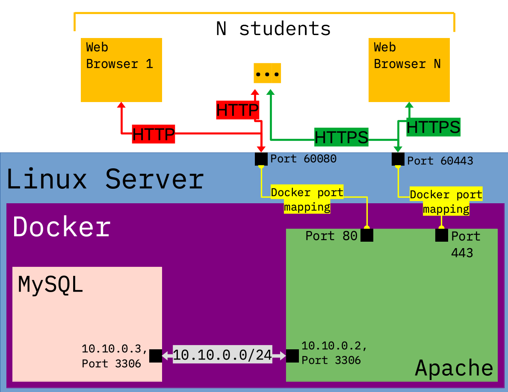

# CTF - SQL Injection

## Easy vs. Difficult Challenges

This challenge has been broken up into two nearly identical challenges, with one being more difficult than the other to solve.
The pertinent files needed to run the easier version of the challenge are in the `easy` directory, and the pertinent files needed to run the more difficult version of the challenge are in the `difficult` directory.
The difference between the easy and difficult challenge is the behavior of the frontend web application.
More specifically, in the easier version of the challenge, the web app will show the user the results of successful SQL queries that are injected via the frontend.
In the more difficult version of the challenge the web app will only show the user the results of failed SQL queries that are injected via the frontend.
* Example:
   * Easy challenge: successfully injecting the **valid** SQL query `SHOW TABLES` will show a webpage containing the results of the valid SQL query: the names of the tables in the database.
   * Difficult challenge: successfully injecting the **valid** SQL query `SHOW TABLES` will not show the results of the valid SQL query; it will show the main to-do list page with all of the tasks in the list.
   * Easy challenge: successfully injecting the **invalid** SQL query `SHOOOW TTTABLES` will not show any output from the invalid SQL query; it will show the main to-do list page with all of the tasks in the list.
   * Difficult challenge: successfully injecting the **invalid** SQL query `SHOOOW TTTABLES` will show a webpage displaying the error message describing the invalid SQL query.

## Docker

The `docker-compose_[easy|difficult].yml` files specify two services and one network for the Docker application.
One service is a frontend web application and the other service is a backend database; and the two services use the specified internal network to communicate with each other.

### Frontend Web Application

The frontend web application is an Apache web server with PHP.
The frontend interfaces with the backend database and will send MySQL queries to manipulate the data in the database.

### Backend Database

The backend database uses MySQL to maintain the data used by the frontend.
The database is initially populated with two tables, specified in `ctf_sql_database.sql`.
The two tables have the same simple layout, consisting of two columns: an int named `id`, and a string named `task`.
The database credentials are specified in the Dockerfile at `image_mysql/Dockerfile`.

### Internal Network

* Easy challenge:
   * The internal network that the frontend and backend use to communicate with each other has subnet `10.9.0.0/24`, and the frontend web app has IP address `10.9.0.2`, and the backend database has IP address `10.9.0.3`.
* Difficult challenge:
   * The internal network that the frontend and backend use to communicate with each other has subnet `10.10.0.0/24`, and the frontend web app has IP address `10.10.0.2`, and the backend database has IP address `10.10.0.3`.

### Running the Application

There are 6 provided shell scripts, `build_[easy|difficult].sh`, `start_[easy|difficult].sh`, and `stop_[easy|difficult].sh` that do as their filename suggests.
If there are any issues that arise while the application is running, the easiest form of troubleshooting will be to stop the application, build it again, and start it up.
**Building the application will delete any data other than the initial tables from the database.**
Users can access the application from a web browser, and should specify the following ports when connecting:
* Easy challenge:
   * Port `50080` for non-TLS connections, [http://\<server-ip\>:50080](http://\<server-ip\>:50080)
   * Port `50443` for TLS enabled connections, [https://\<server-ip\>:50443](https://\<server-ip\>:50443).
* Difficult challenge:
   * Port `60080` for non-TLS connections, [http://\<server-ip\>:60080](http://\<server-ip\>:60080)
   * Port `60443` for TLS enabled connections, [https://\<server-ip\>:60443](https://\<server-ip\>:60443).

### Docker Architecture

The following image shows the Docker architecture of the easy version of the CTF challenge:

The following image shows the Docker architecture of the hard version of the CTF challenge:

## Implementation

Whenever a web client connects to the web app, a new PHP session will be started.
Upon creation of a new PHP session, a copy of the two initial tables in the database will be made for each session.
This is so that each client will have their own copy of data in the database to manipulate.

### Known Defect

The system does not perform any cleanup of the database.
Since each new web client that is connected starts a new PHP session, which in turn will create two new tables in the database, this poses a risk for the database to grow too large.
It is a shortcoming of PHP to require input from a client before it can do anything, so PHP is not aware that a web client has disconnected because it's looking for input, which it won't receive since the client has disconnected.
If you suspect that the database is growing too large, you can manually delete tables from the database by connecting to the Docker container hosting the database, or simply delete the database by rebuilding the application.

## CTFd

The file `challenge-Web_SQL_Injection_[easy|difficult].csv` can be loaded into CTFd to automatically add the challenge to an existing CTFd instance.
Additionally, the challenge is included in the `SEED_Labs_CTF-Web.zip` file, which is a snapshot of a CTFd instance will all of the web CTF challenges loaded, as well as the `challenges_all.zip` file, which is a snapshot of a CTFd instance with all of the CTF challenges from all categories loaded.

