# Open-Source CTF Platform Manual

## Contents

* [For Administrators](#for-administrators)
   * [Videos](#videos)
   * [CTFd](#ctfd)
      * [CTFD-as-a-service (hosted)](#ctfd-as-a-service-hosted)
      * [Self-hosted](#self-hosted)
      * [Admin Account Setup](#admin-account-setup)
      * [Changing Admin Account Credentials](#changing-admin-account-credentials)
      * [View, Edit, and Create Challenges](#view-edit-and-create-challenges)
      * [Importing challenges](#importing-challenges)
         * [Importing challenges in `.zip` files](#importing-challenges-in-zip-files)
         * [Importing challenges in `.csv` files](#importing-challenges-in-csv-files)
      * [Challenge Docker Containers](#challenge-docker-containers)
         * [Shell Scripts](#shell-scripts)
      * [Management and Troubleshooting](#management-and-troubleshooting)
* [For Students](#for-students)
   * [What is a CTF?](#what-is-a-ctf)
   * [How to participate](#how-to-participate)

---

## For Administrators

### Videos

The following videos show a quick walkthrough of setting up the SEED Labs CTF and a quick tour of its usage:
* [CTFd and .zip import](./videos/SEED_CTF_setup_part1.mp4)
* [SEED Labs CTF tour](./videos/SEED_CTF_setup_part2.mp4)

### CTFd

This project utilizes the open source [CTFd](https://ctfd.io/) capture the flag platform to host the infrastructure needed to operate a successful capture the flag challenge.

#### CTFD-as-a-service (hosted)

CTFd offers a hosted version of the platform, in which they will set up the infrastructure needed to run CTFd and give you access to the management interface.
The CTFd hosted option is available for a cost, and more information can be found [here](https://ctfd.io/pricing/).

#### Self-hosted

Please follow the [CTFd Docker installation instructions](https://docs.ctfd.io/docs/deployment/installation#docker) to install the platform on your own hardware.
By default CTFd does not have TLS enabled.
There are tutorials online for enabling TLS on your CTFd Docker instance.
For your convenience, [this is a third-party GitHub repo](https://github.com/tghosth/CTFd-docker-deploy) with easy deployment instructions for CTFd with TLS enabled.
Once CTFd is installed and running you're able to import the provided CTF challenges into the platform.

#### Admin Account Setup

1. Visit the CTFd site you launched above and click login.
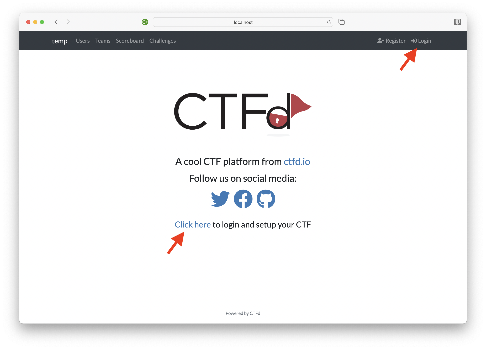
2. Login with default admin credentials (obtained by contacting the project maintainers; see bottom of page).
3. Change the default admin credentials to your desired credentials (see below for procedure).

#### Changing Admin Account Credentials

1. Login with the default admin credentials (obtained by contacting the project maintainers; see bottom of page), then navigate to the admin panel.
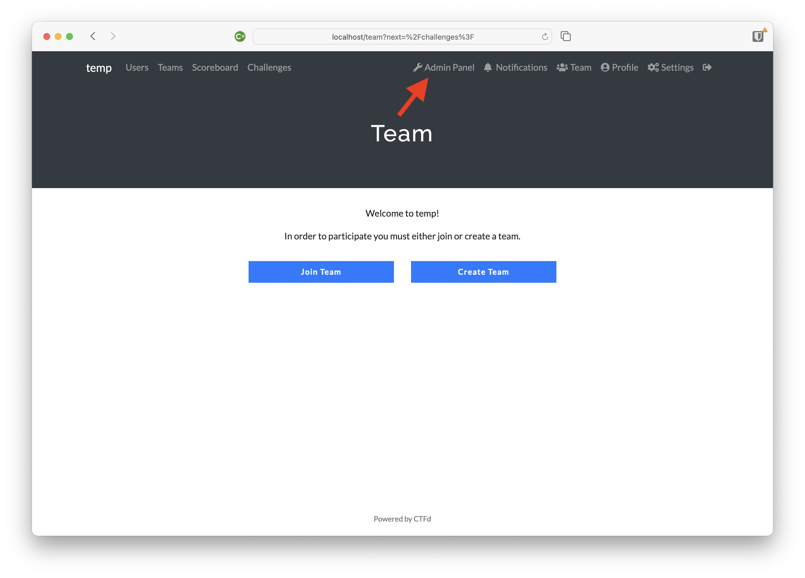
2. Navigate to the "Users" page.
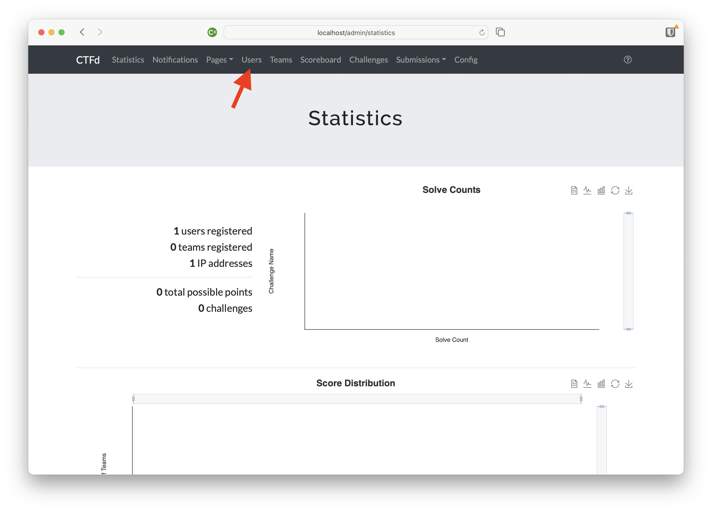
3. Select the ⊕ symbol to add a new user.
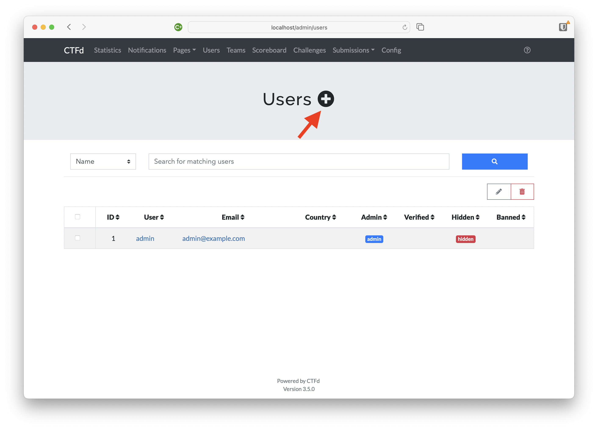
4. Fill out the new user account details. Ensure that you set the account type to "Admin".
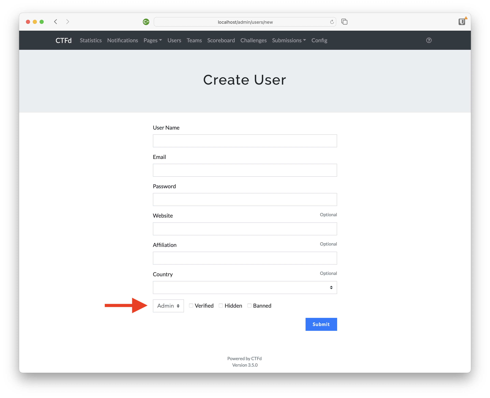
5. After you have created the new Admin account, delete the default Admin account from the "Users" page.
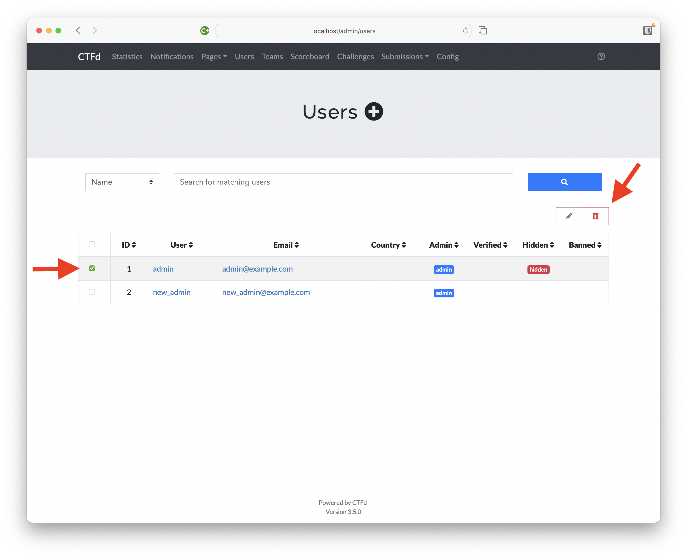

#### View, Edit, and Create Challenges

To view the existing challenges currently loaded into the CTFd platform:

1. Navigate to the Admin Panel.

2. Navigate to the Challenges page.
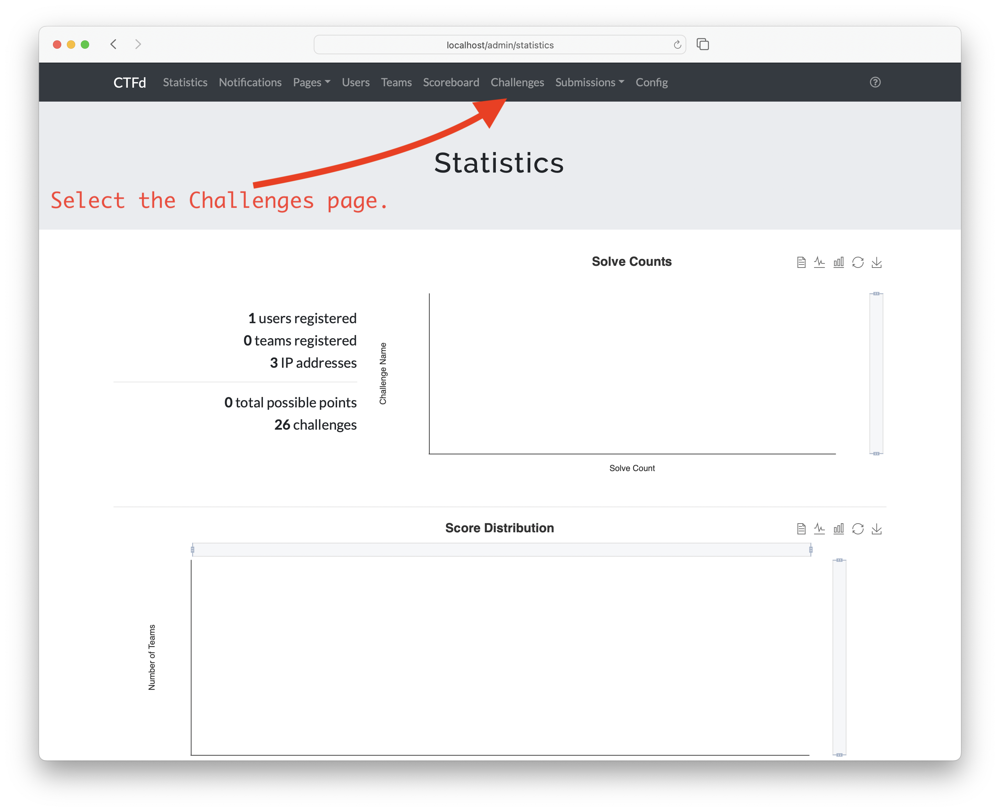
3. See all of the challenges that are currently loaded into the CTFd platform.
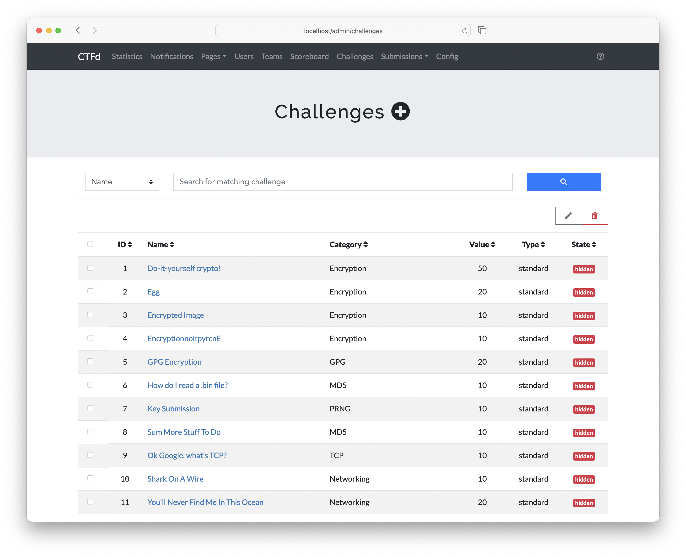

To create a new challenge:
4. Select the ⊕ symbol.
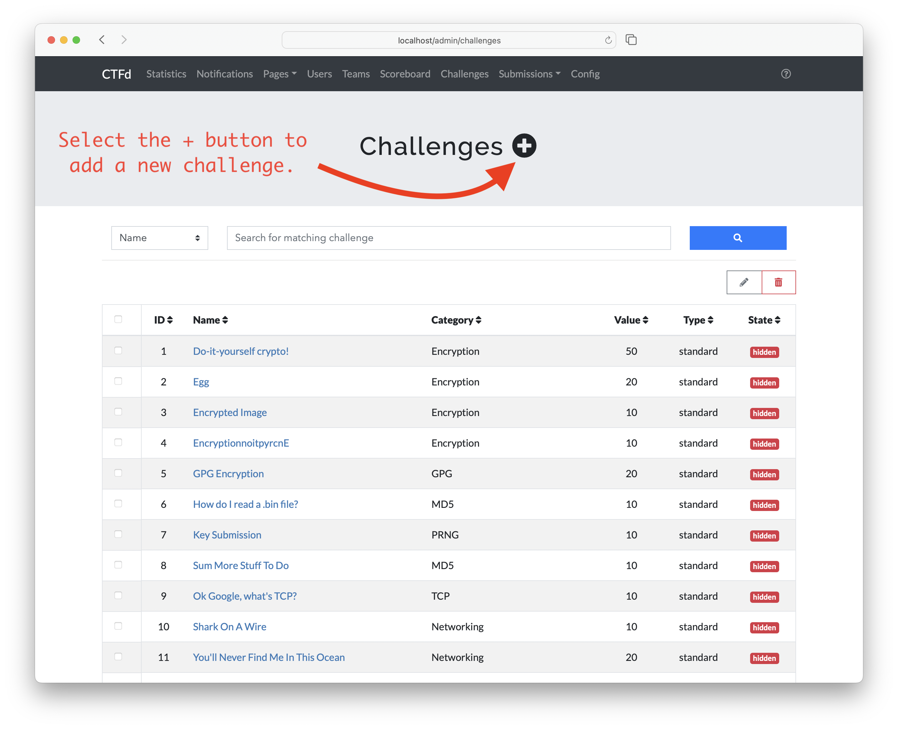
5. Fill out the pertinent challenge details on the next page.

To view and edit the details of a challenge:
6. Select the challenge name hyperlink.
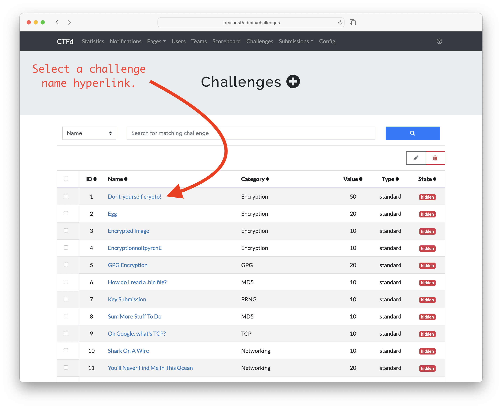
7. Modify any of the challenge details that you wish to change, then hit Update.
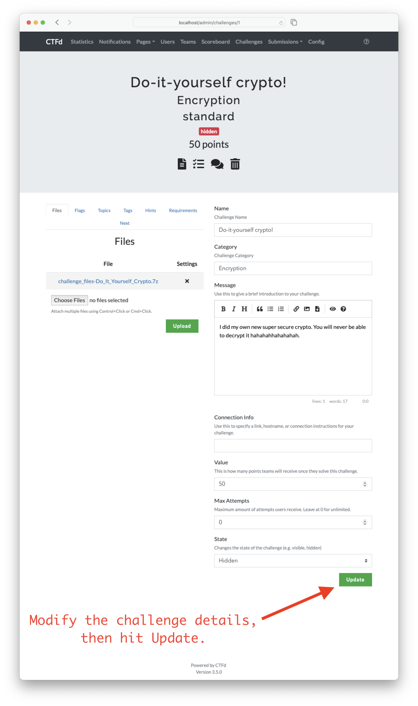

#### Importing challenges

There are two main ways to import CTF challenges into the CTFd application:
1. Visit the CTFd site you launched above and click login using Admin credentials.

2. Navigate to the Admin Panel.

3. Next, navigate to `Config > Backup`.
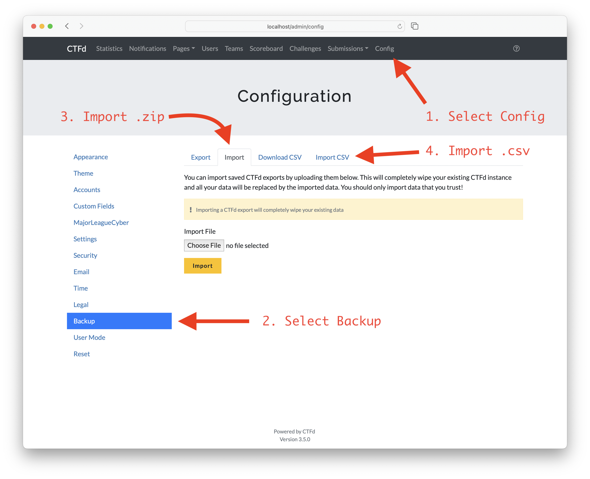

From here there are two options: importing a `.zip` or importing `.csv`.
There are a few differences between the two import options:

##### Importing challenges in `.zip` files

* **This will overwrite any existing configurations you have in place**, including user accounts, challenges, files, etc. This essentially imports a snapshot of the CTFd application at the time the `.zip` file was generated.
* Multiple challenges can be imported in a single `.zip` file.
* Files needed to complete the challenges will be included when imported.
* See the [CTFd documentation on importing `.zip` files](https://docs.ctfd.io/docs/imports/overview#importing-exported-data) for more information.

##### Importing challenges in `.csv` files

* This will not overwrite any existing configurations you have in place.
* Multiple challenges can be imported in a single `.csv` file.
* Files needed to complete the challenge **will not** be included when imported.
* See the [CTFd documentation on importing `.csv` files](https://docs.ctfd.io/docs/imports/csv) for more information.
   * The `.csv` file used to import challenges must adhere to a specified layout.
     Use the [CTFd challenges CSV template](https://docs.ctfd.io/assets/files/challenges-template-ede1d7042b4b1ce5f6a500e87dda483f.csv) to adhere to the required layout.

#### Challenge Docker Containers

Most of the CTF challenges will require spinning up a Docker container that will host the infrastructure that is unique to running that challenge.
The pertinent information for setting up challenge specific Docker containers will be included in a `README.md` file along with the other CTF challenge files.

##### Shell Scripts

Shell scripts are provided in each challenge directory to assist with building, starting, and stopping the challenge Docker containers.

**NOTE:** When running the Docker containers on Linux, root priviliges (`sudo`) may be needed when running the included shell scripts that assist with building, starting, and stopping the CTF Docker containers.
When running the helper scripts on Linux, simply prepend `sudo` on the command line:
```
$ sudo ./SCRIPT_NAME.sh
```
Root priviliges should not be needed when running Docker on MacOS.

#### Management and Troubleshooting

Student passwords can be reset through the admin panel by clicking on the user in the "Users" tab.
If the server goes down, the containers for both CTFd and the docker challenges may need to be restarted. Use the same docker command from the CTFd setup instructions to launch CTFd, and use the "start containers" bash script in the server challenges folder to restart all challenge containers.
It is possible you may need to forcibly shut down and remove old container versions if the server restarts.
Challenges can be enabled/disabled/modified on the fly using the admin panel of the platform online.
Challenge solutions are available to instructors upon request (see bottom of page for contact info).

---

## For Students

These instructions can be copied to students to introduce them to CTFs and inform them of how to participate in this CTF platform. Note that you (the administrator) need to plug in the web address of the CTF server in the instructions.

### What is a CTF?

A [CTF (Capture The Flag)](https://en.wikipedia.org/wiki/Capture_the_flag_(cybersecurity)) is a kind of information security competition that can challenge contestants to solve a variety of challenges, ranging from a scavenger hunt on Wikipedia to basic programming exercises, to hacking your way into a server to steal data.
In these challenges, the contestant is usually asked to find a specific piece of text that may be hidden on the server or behind a webpage.
This goal is called the flag, [hence the name](https://dev.to/atan/what-is-ctf-and-how-to-get-started-3f04)!
In the context of this class, these challenges are in CTF format, where each submission consists of a string of text.
The challenges are designed to test your mastery of the hands-on security material covered in class, as well as proficiency with the security tools used.

### How to participate

Please navigate to the following link: [your server DNS here].
You may get a security notification that the site is not secure; if so, go to the "advanced" option continue anyway.
If Chrome does not work as a browser, Firefox should.
Please register a new account using your school email address and a username.
Make sure you also remember your password for future logins.
Once you log in, you should see a page with challenges for you to complete.
Use the prompts and files provided to find the flags!

---